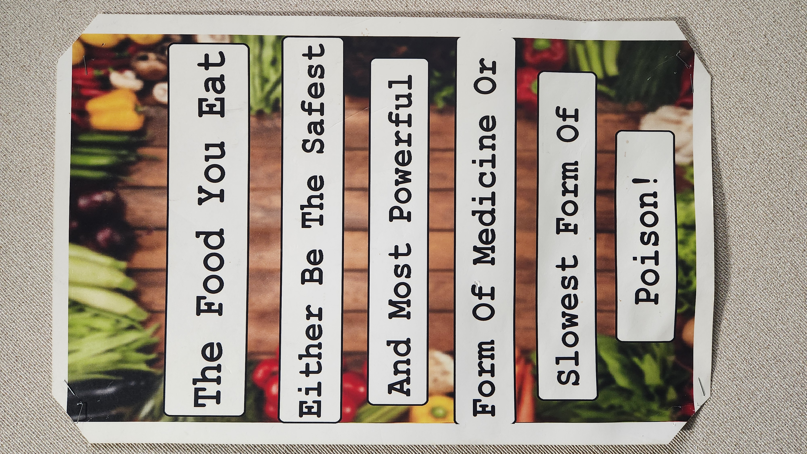

**Week 7 2026**

**Tuesday**

This is a culinary class. Today, all the students are doing the same assignment on their computers.  It has something to do with looking at a recipe for red velvet cookies.  Not all days can be hands on when in a culinary class, especially when the teacher is out.  I would not want to be liable for watching these kids I do not know, using knives, ovens, and other potentially dangerous equipment in the room.  It is nice that there are restrooms in the room as well. No students need to ask me to leave.

I do see one former student.  I remember talking to her a few months ago and she actually did not like her 5th or 6th grade teacher.  She says that the teacher did not like her.  I found this to be wildly unbelievable, as kids do not always understand why adults act as they do.  I know this teacher to be very loving to all people, very kind, and forgiving.  Perhaps she was just strict and didn't back down from her promises and the student took that as mean or personal dislike.

I spoke to one of the paraeducators in 5th period.  I remember her from other classes, but she may have mistaken me for someone else.  We talked for a bit about heart with a pocket origami, student cell phone use, immigration status, and marriage.  She was really excited about making the origami heart.  I looked up a video that we watched to see how to do it.  We could not find scissors, so she didn't end up making them in class.  When we talked about marriage and having children, she had brought up her son who was going to get married, but ended up breaking the engagement.  He is a few years younger than me and used to go to school in the same grade as one of the PE teachers here now.  Both her and her son were sad about the break.  It is better now than after they get married, for sure.  It seems like she was a believer in God as well.  

One of the reasons marriage seems to be low right now, is because it is Satan's plan.  He does not want us to have kids who love God and love people.  The easiest way is to attack marriage itself.  When people don't feel a reason to stay together, they will be less likely to have children, and when they do, they may still separate and leave the children to struggle to grow up without both biological parents.  The cycle continues because those children grow up thinking that it is normal to have a blended family, or one parent.  The children can recover, but there is irreversible damage.  Damaged children create damaged adults.  

She shared with me about her journey to become an American citizen.  She is not from the USA, but she did come here at the age of 15.  She had to pay hundreds or close to a thousand dollars to get her citizenship.  We talked about the people who neglected to do the same. Some, of course, could not afford it, but it turns out that they may have had three or more years to work and save up to pay for the costs of citizenship.  It turns out that some people have come to America, and never filed the proper paperwork.  It has been a solid year of immigration reform, if that's what it's called.  Still, many are upset about the idea that they needed to get the proper paperwork started or completed within that year.  Now, in the year 2026, there are many who feel targeted or singled out because they are getting deported.  I have a hard time understanding the issue unless it is just defiance, some ignorance, but it seems likely that the ones who are worried are the ones who are going to continue to do illegal activities.  I also understand that the agency in charge of finding these criminals are having a hard time with violence and people being submissive.  I get it.  Some agents may be overly aggressive.

**Wednesday**

This school is different.  Every time I have come here, I have had class sizes of 5-10.  Every class period it seemed I still had absent students.  There are maybe 12 classrooms in total.  I like it very much because it is a setting where real learning can happen.  The classes are so much slower paced.  The issue I see is that the students that come here seem to have no motivation to graduate.  They don't seem to want to do any work; they may be trying to catch up on credits or trying to graduate early.  Some, I think, are here because they got expelled or close to expulsion from one of the other schools.  I suppose each student is different.

There is another adult in the room who has some students as well. Only two of her students have come in the first hour.

So far, only three students have come in the first hour.  One showed up, looking for the regular teacher, who is out for her health, the other two came to stay for a while.  Only one of them turned in any work and looks like they are actually doing more school work.

This school reminds me of when I used to be a paraeducator around the year 2015.  I was in a class that was considered its own school.  Those students were very much expelled or on the verge of expulsion. They were to come to the school to work independently.  The grades were 7th through 12th.  In the three or four school years I was there, I only remember a few graduates.  The rest dropped out or aged out.  We did have one student who was pregnant.  I do not remember what happened to her.  

It's February, on the wall in this class it looks like there are five students who graduated so far.

**Thursday**

This class is one I did for four days in a row earlier this year.  In the first period, there was a group of three friends who I admired.  They seemed to get along fairly well and were honest with each other.  I had asked them how long they knew each other and it was just since the beginning of the school year.  At one point during those four days, they talked about starting a band. It was two girls and a boy.  The boy had mentioned twice that he liked my singing.  I was sitting at the desk, listening to some music, and quietly singing along.  At first I was not sure if he was serious.  He's commented on my singing every time that I have been back to that class.  This time, he wanted me to sing a song for him.  I was definitely nervous, but I asked which song.  It was not one I knew.  I started to listen to it, and as good as it may have been, musically, the lyrics were not something I would sing.  Not only were there a few curse words, it seemed to be about a topic that I am against.  I did not want to add any new evils to my life.

I struggle with this a little.  There are things that I do or have enjoyed in the past, that I know are essentially evil.  I even gave an example to the boy of the musical, Rent.  I enjoy the music.  I even wanted to completely get rid of it from my life at one point.  I do not recall if I made it a demand or if it was just something that my wife was compelled to do, but she used to own the DVD before we were together or married.  She got rid of it at some point in our marriage.  Now I know we own the songs in a digital format.  I may even have a few on my phone right now, downloaded.  I must say that I did first get exposed to the musical in my choir class. We sang "Seasons of Love."  That song may be evil, or it is a secular person's attempt at describing love.  Either way, I feel a bit of conviction on this topic.  If something is a little good, that may mean it is also a little evil.  I do not believe God wants us to be involved in any evil.  It is difficult for me.  I don't think it is possible to completely avoid evil, because it is in us as humans. That is what I believe God meant when he said that we were born in sin.  Sin entered the world.  However, we can avoid the big obvious evils, and we can avoid the smallest ones that we can see.  Some people may call computers evil, and there is truth to that.  I understand the further we look into each aspect of our lives, the more we might see what is of God and what is not.  There cannot be a single way for everyone at every time of their life.  I understand it is my responsibility to protect those I care about as much as possible.  I need to protect my enemies as well.  God loves everyone.

Some may call public school evil as well.  That's a topic for another day, though.

As far as the class itself, there was some structure, but it seemed clear to me that there is something lacking.  These are a few observations of what I view as concerns or small signs that something is off.  The seating chart was not updated.  The students had maybe 5-10 minutes worth of work to do on a single sheet of paper.  They could easily and did use AI to complete their work.  The work that all but one class period had, did not make much sense in itself.  A math crossword puzzle, without any list of terms or word bank to use.  Perhaps the class had been working on math vocabulary, but I could not find anything to help the students in a textbook or around the classroom.  At least two of the questions on one of the worksheets could have been anything as far as I understood.  Some of the words looked like a standard math definition, but I was unable to help with the entire assignment.  This structure is similar to the last time I came to this class.  For the four days I was there, by the second day, I made my own seating charts, using the attendance program that I use for all the schools in this district.  I started with a hand drawn one, then transferred it to the program.

All that and this class had a co-teacher.  She was helpful at times, but I cannot say I liked her attitude towards the classes.  I cannot know what goes on when the permanent teacher is there.  She came in during the 1st period, we talked a bit, but like other times, she said she would come back.  She never came back or called.  I called her to ask about a student who left the room.  She did say that she sometimes takes students in her room to work, but I do not know who made it over there.  This school has a culture of wandering students.  

I also noticed one day, I was able to leave just a few minutes early at the end of the day because that teacher came back.  As I was leaving, I saw many, many students already walking out of classes, and in the courtyard area.  It's as if the whole school doesn't seem to follow a schedule.  I do not go there every day, and I cannot know exactly what is happening.  I do know that there is one paved road in and out of this school.  Part of the reason it takes a long time to exit the school by car, is because the students who walk home, all go almost the same way.  They get to a three-way intersection, and many of them simply cross diagonally, holding up the cars for several minutes.  It is already crowded, and this is a danger.  I imagined that perhaps it would be a good idea to create a pedestrian bridge over that intersection, but I figure the government would never allow it. Whoever planned the building of this school did not do something right.  There really should be more than one way in or out with a paved road.  It is part of the reason I try not to come to this school.  I typically have to wait a solid 15 minutes after dismissal, before I can start driving home, without having to wait in the traffic of several stop signs and 40+ cars.  It is the same in the morning. If I do not leave 45 minutes before school starts, I may not make it to the class on time.  I only live less than 9 miles away.

**Friday**

This school typically is more structured and better off than most of the others. They do require a uniform.  I like coming here, except it has seven class periods and it also has a bit of a parking lot and one road situation.  It is not as difficult to get into the school.  I left about 30 minutes before class started and I made it to the class about five to six minutes before class started.  So that includes a few minutes of talking to the secretary and finding the room itself.  So my drive time might have been only about 19 minutes.  It looks like there is an assigned parking section for staff, which may help with the traffic a bit.  Or, this school just has less students.

This math class looks good in the decor.  I can tell this teacher is trying to create a good environment and expectations to learn.  

Not a very exciting class.  The teacher desk is in a place that seems to suggest that she stands a lot.  She may not use her computer much during the class period.  It makes for a mostly uncomfortable day for me.  It is also odd because where I would sit blocks my view of most of the class. There is a podium nearby and a shelf, too.  It makes me feel like I have to get up and walk around.  This school has students with much better classroom behavior.  I do not feel like they are going to do much other than their work and talk.  A few students have been off task, but I see a lot of them working and finishing.  Unlike other classes where the students do almost no school work and use their phones for the entire class period.
