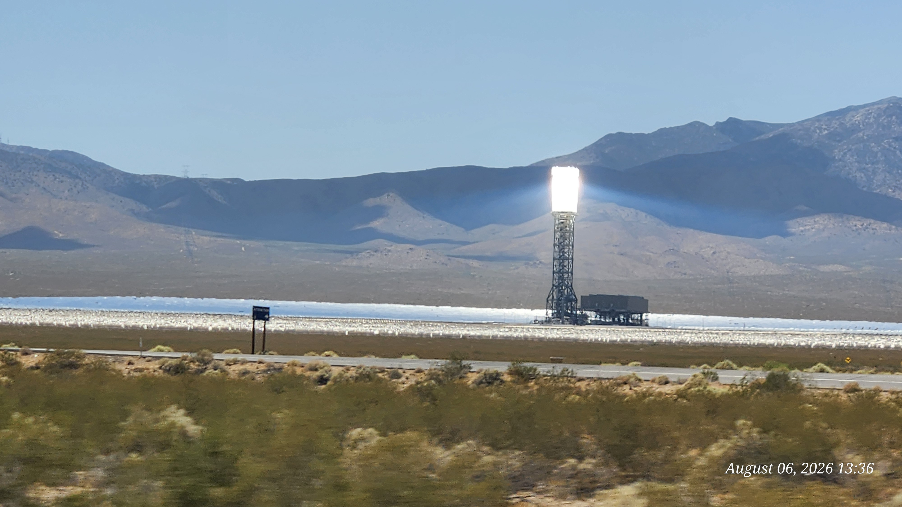
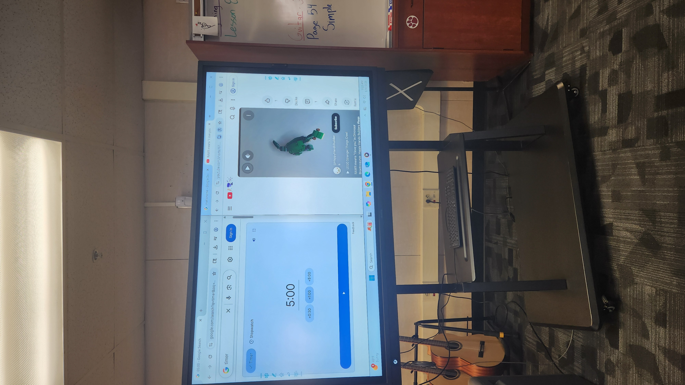

I am testing adding multiple images.  It seems that I can add titles to each image.  There is only one image allowed for the main page.  I can also add alternative text to each image.  I am not sure what that means.

